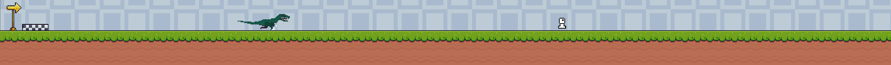

# GDEV Workshop🎮

### Table of Contents
* [TODO](#todo)
* [Overview](#overview)
* [Workshop Objectives](#workshop-objectives)
* [Quick Start](#quick-start)
* [Game Assets](#game-assets)
* [Tools & Resources](#tools--resources)
* [Video Demo](#video-demo)
* [Feedback](#feedback)


---

## Overview

Welcome to the **Introduction to Game Development Workshop**! This workshop is tailored for beginners who are eager to learn the fundamentals of game development. By the end of the session, you'll have created a simple game and gained a solid understanding of how to continue building on these skills.

## Workshop Objectives

By participating in this workshop, you will:
1. **Understand** the key concepts of game development, such as game loops, sprites, and collision detection.
2. **Set up** a game development environment using [INSERT TOOL HERE] (e.g., Unity, Unreal Engine, Godot).
3. **Create** a basic 2D game.
4. **Learn** to control characters and objects in a game world.
5. **Implement** game mechanics like player input, scoring, and win/loss conditions.
6. **Test and debug** your game for functionality.
7. **Feel confident** in your ability to explore more advanced game development topics.

## Quick Start 🚀

To get started right away, follow these steps:

1. **Download the GitHub Repo**: 
   - [Download the repository](https://github.com/MitchellTucker1/CS-GDev) as a ZIP file.

2. **Unzip the Project**:
   - Extract the ZIP file to a designated folder on your machine.

   - WHERE SAVING?

3. **GoDot Project Startup**:

   1. **Launch Godot** 

      - Open File Explore and copy and past the following path to GoDot's executable into the seach bar.

         *This PC -> Local Disk (C:) -> SBCC -> apps -> Godot_v4.2.2-stable_win64*
         ```
            C:\SBCC\apps\Godot_v4.2.2-stable_win64
         ```

      - Double click *stable_win64* to launch Godot
         <details>
         <summary><b>Example</b></summary>

         
         </details>
      

   2. **Import the starter project**

      *Note: On launch you may be prompt to explore official examples projects, select (**Cancel**)*

      1. Select **Import**.

         <details>
         <summary><b>Visual</b></summary>

         
         </details>
      

      2. Navigate to where you saved the starter project directory | folder
         <details>
         <summary><b>Visual</b></summary>

         
         </details>

      3. Finally select Import & Edit

         <details>
         <summary><b>Visual</b></summary>

         
         </details>

4. **Explore the Starter Level**
   - Open the starter level in the project to familiarize yourself with the basic setup.

5. **Start Building**:
   - Begin by modifying and adding new elements to the starter level to create your own game.

## Workshop Outline

### 1. Introduction
   - Overview of the workshop objectives and schedule.
   - Brief introduction to the world of game development.

### 2. Setting Up the Environment
   - Step-by-step guide on how to install and configure [INSERT TOOL HERE].
   - Walkthrough of project setup and environment basics.

### 3. Basic Game Concepts
   - What are **game loops**, and why are they important?
   - Introduction to **sprites** and **game assets**.
   - Understanding **collision detection** and **game world dynamics**.

### 4. Hands-on: Building Your First Game
   - Start building your game by adding characters and objects.
   - Implementing simple mechanics: player movement, collision, and scoring.
   - Building levels and incorporating game logic.

### 5. Testing and Debugging
   - Testing the game within the engine.
   - How to identify and fix common bugs.
   - Playtesting your game and improving its design.

### 6. Q&A / Wrap-up
   - Open floor for participant questions and troubleshooting.
   - Additional resources for further learning and next steps.

---

## Tools & Resources

1. **Game Engine**: [Download Godot](https://godotengine.org/download) or [Insert relevant game engine link].
2. **Tutorial Resources**:
   - [Official Godot Docs](https://docs.godotengine.org/en/stable/)
   - [Beginner's Game Development Guide](#)
3. **Sample Project**: [Link to GitHub Repository or another file-sharing platform](#).

## Game Assets

- **Dino Project**: The project header and assets will include visuals from a dinosaur-themed project for beginners to practice with.
- **Free Game Design Libraries**:
   - [Kenney Assets](https://kenney.nl/assets)
   - [OpenGameArt](https://opengameart.org)

---

## Video Demo

To preview what you will be working on, check out this [video demo](#) of the finished project.

---

## Feedback

We value your feedback! After the workshop, please take a moment to fill out our [feedback form](#) to help us improve future events and workshops.

---

## TODO

- **Short Presentation**
    - What is a:
        - **Sprite**: An image used to represent characters, objects, or backgrounds.
        - **Bounding Boxes**: Rectangles that define the area for collision detection.
        - **Game Loop**: The cycle that keeps the game running by updating frames.
        - **Collision Detection**: The method of detecting when objects in the game world interact.
        - **Game Physics**: How objects move, behave, and interact based on certain rules.
        - **Assets**: Resources like images, sound, and text that are used in the game.
        - **User Interface (UI)**: The interactive elements like buttons, menus, and HUD.
        - **Player Input**: How a player controls the game (e.g., keyboard, mouse, controller).
        - **Level Design**: Structuring the game environment for player interaction.
        - **AI (Artificial Intelligence)**: How non-player characters (NPCs) behave in the game.

- **Assets**:
    - Add **Dino Project** assets to the header.
    - Include links to additional game design libraries (e.g., Kenney or OpenGameArt).

- **Starter Code**:
    - Prepare the **Godot** starter project with a basic menu and a start level for participants to build upon.

---

**Happy Game Developing!** 🎮
